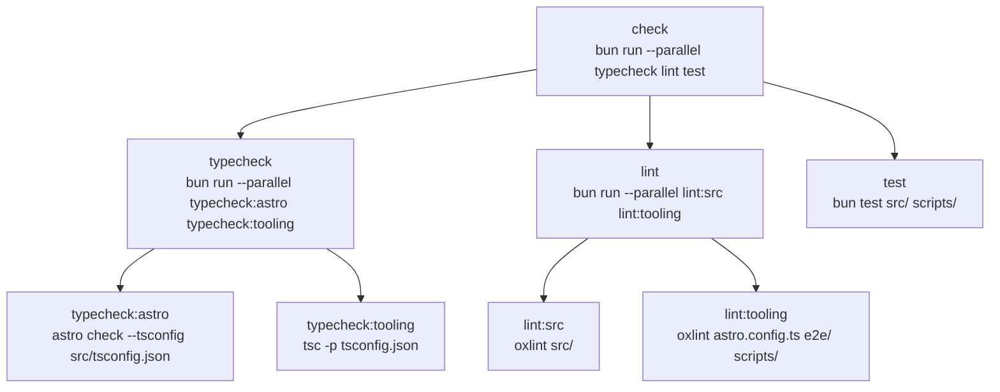

# Current Script Graph

The current `package.json` scripts form a small tree rooted at `check`.



## Observations

- Parallelism exists in two layers today:
  - `check` and `check:full` fan out to `typecheck`, `lint`, and `test`
  - `typecheck` and `lint` each fan out again into two leaf commands
- The leaf commands are already the right granularity for Taskfile `deps`.
- `Taskfile.yaml` currently does not model any of these checks yet.

## Target Task Shape

The clean migration path is to turn every existing leaf script into a Task task,
then rebuild the aggregate commands with `deps`.

Suggested shape:

```yaml
version: "3"

tasks:
  typecheck:astro:
    cmds:
      - bun astro check --tsconfig src/tsconfig.json

  typecheck:tooling:
    cmds:
      - bun tsc -p tsconfig.json

  typecheck:
    deps: [typecheck:astro, typecheck:tooling]

  lint:src:
    cmds:
      - bun oxlint src/

  lint:tooling:
    cmds:
      - bun oxlint astro.config.ts e2e/ scripts/

  lint:
    deps: [lint:src, lint:tooling]

  test:
    cmds:
      - bun test src/ scripts/

  check:
    deps: [typecheck, lint, test]
    failfast: true

  check:full:
    deps: [typecheck, lint, test]
```

## Migration Plan

1. Add atomic Task tasks for every current leaf script. Keep each task as a thin
   wrapper around the exact existing command so the migration changes
   orchestration first, not tool behavior.

2. Add aggregate Task tasks with `deps`. Start with `typecheck`, `lint`,
   `check`, and `check:full`.

3. Preserve the semantic split between `check` and `check:full`. `check` should
   be fail-fast if we want to mirror the normal fast-feedback path. `check:full`
   should omit `failfast` so all parallel branches complete.

4. Switch callers from `bun check` to `task check` and from `bun check:full` to
   `task check:full`. This includes `deploy` in `Taskfile.yaml`, plus any CI
   entrypoints that currently shell out through package scripts.

5. Keep the `package.json` scripts as compatibility shims during the transition.
   A low-risk intermediate state is for the scripts to call Task:
   - `check`: `task check`
   - `check:full`: `task check:full`
   - `lint`: `task lint`
   - `typecheck`: `task typecheck`

6. Remove duplicated orchestration once Task becomes the single entrypoint. At
   that point, `package.json` can keep only leaf-level developer utilities or
   only compatibility aliases, depending on how much Bun script ergonomics we
   still want.

## Open Questions

- Do we want `deploy` to call `task check` or to inline `deps` under `deploy`?
  Reusing `check` keeps one source of truth.
- Do we want concurrency limits for local machines or CI? Task supports global
  concurrency control, but the current graph is small enough that the default is
  probably fine.
- Should `test:coverage`, `test:e2e`, and `test:slow` also move into Task now,
  or only after the core `check` path is stable?
