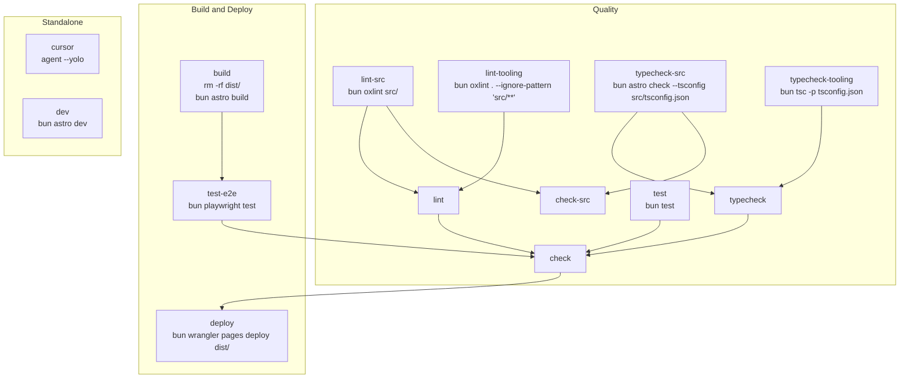

# Task Graph

This document maps the tasks defined in `Taskfile.yaml`.

Arrows point from a dependency to the task that depends on it.

## Aggregate Tasks

- `lint` depends on `lint-src` and `lint-tooling`.
- `typecheck` depends on `typecheck-src` and `typecheck-tooling`.
- `test` runs `bun test`.
- `test-e2e` runs `bun playwright test` after `build`.
- `check-src` runs the `src/`-only lint and typecheck tasks.
- `check` runs the full lint, typecheck, `test`, and `test-e2e` tasks.
- `deploy` requires `check`.

## Standalone Tasks

- `cursor` runs `agent --yolo`.
- `dev` runs `bun astro dev`.
