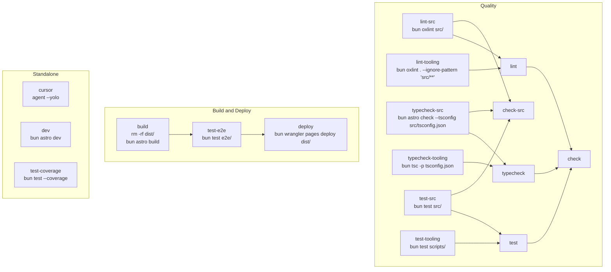

# Task Graph

This document maps the tasks defined in `Taskfile.yaml`.

Arrows point from a dependency to the task that depends on it.

## Aggregate Tasks

- `lint` depends on `lint-src` and `lint-tooling`.
- `typecheck` depends on `typecheck-src` and `typecheck-tooling`.
- `test` depends on `test-src` and `test-tooling`.
- `check-src` runs the `src/`-only lint, typecheck, and test tasks.
- `check` runs the full lint, typecheck, and test aggregates.
- `deploy` requires `test-e2e`, which requires `build`.

## Standalone Tasks

- `cursor` runs `agent --yolo`.
- `dev` runs `bun astro dev`.
- `test-coverage` runs `bun test --coverage`.
